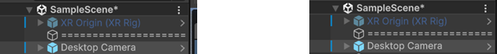
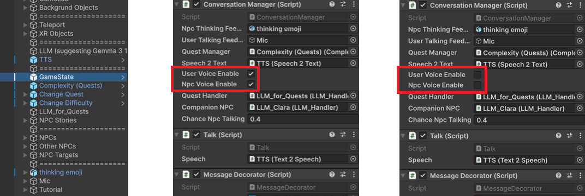

## SimVille

We present SimVille, a mixed reality game that combines extended reality (XR), large language models (LLMs), and conversational non-player characters (NPCs) to explore new forms of immersive, socially interactive learning. In SimVille, players engage in quests by conversing naturally with embodied NPCs, where dialogue is dynamically generated through LLMs. The game leverages XR to situate interactions in a shared physical-digital environment, enabling players to move, explore, and connect with NPCs in contextually rich scenarios. Beyond quest completion, the system investigates how adaptive dialogue, social cues, and narrative-driven embodiment can support the development of communication skills, such as small talk, irony detection, or emotion recognition. We describe the design of SimVille, including technical integration of XR and LLM pipelines, interaction mechanics, and a framework for evaluating conversational experiences. Our contribution highlights opportunities and challenges in creating explainable, personalized, and engaging human–AI interactions in augmented and mixed reality.

## 📄 Paper (Draft)

 \[Download SimVille.pdf](https://github.com/ChristianPoglitsch/AI_Sims/blob/dev/SimVille.pdf)

## Unity Game Scene
### Game Scene

-> Assets/Scenes/SampleScene

Before you start:

\- GameState: Change between TTS/STT and chat based system

\- Camera: Change between Desktop and XR camera

### Simple Chat

-> Assets/Scenes/Chat_Order, Assets/Scenes/Chat_Team

## Unity Plugins

### Avatars / Characters

[Integrating Ready Player Me characters into Unity](https://readyplayer.me/blog/integrating-ready-player-me-characters-into-diverse-game-art-styles-demo-using-shaders-in-unity)

### Large Language Model - Unity Integration

[LLM for Unity (Unity Asset Store)](https://assetstore.unity.com/packages/tools/ai-ml-integration/llm-for-unity-273604)

### Text2Speech (TTS) / Speech2Text (STT)

⦁	TTS: Requires an OpenAI API Key

⦁	STT: Use a local Whisper server -> https://github.com/ChristianPoglitsch/AIAgents/blob/dev/TTS_STT/tts_server_app.py

## 🧰 System Requirements

\- Memory: 32 GB (minimum)

\# 🧠 Large Language Models (LLMs)

> ⚙️ GPU recommended

| Model   | GPU Memory Requirement |

| Mistral | ~6 GB VRAM |

| Gemini  | ~12 GB VRAM |

🚀 Notes

\- LLMs can run on CPU, but performance will be significantly slower.

\- For best results, use a GPU with CUDA support (e.g., NVIDIA RTX series).

\# 🎙️ Whisper (Speech-to-Text)

> 🖥️ GPU recommended

\- Memory: ~2 GB VRAM

\# Game

> 🖥️ GPU

\- Memory: ~2 GB VRAM

## Switching Between XR and Desktop

Switch from XR to Desktop version by deactivating XR Origin (XR Rig) and activating Desktop Camera as shown in the image below.

## Switching Between TTS/STT and Chat-Based Mode

Switch between Text2Speech/Speech2Text mode and the Chat-based system by adjusting the GameState settings, as shown in the image below.

## Future Work

Facial Animations + Emotions:
https://docs.readyplayer.me/ready-player-me/integration-guides/unity/setup-for-xr-beta/facial-animations

## Authors

- Christian Poglitsch